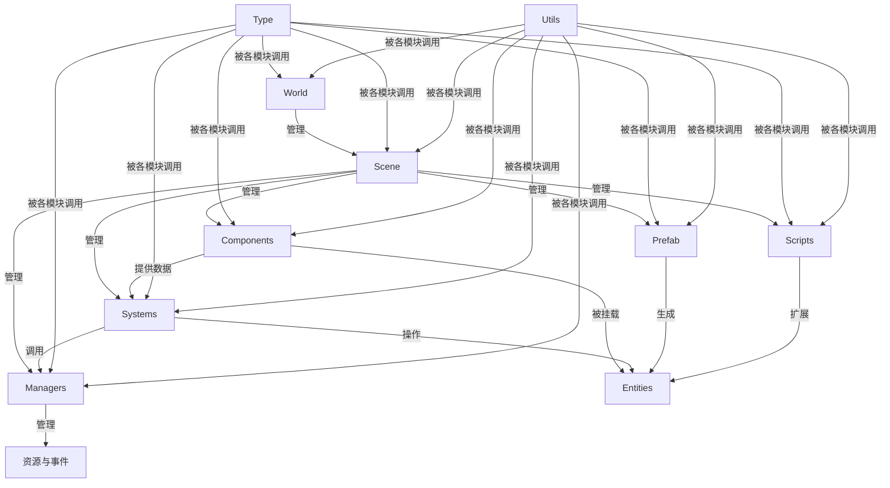
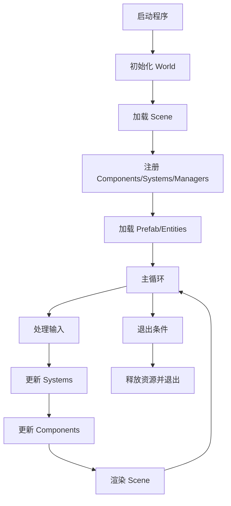

# lucknight

这是一个类似混乱大枪战的游戏，使用了元气骑士的素材。

* 名字来源: 元气骑士 `soul knight` , 加上开宝箱的抽奖元素`luck`

## 我学到/用到了什么

* Unity拆包(元气骑士素材)
* ECS架构
* 宏和模板
* CMake多项目
* 使用的库: ECS框架:`entt`, 预处理:`boost_preprossor`, 多线程:`enkiTS`, 物理引擎:`box2d`
* 复用了之前大作业造过的QtOpenGL轮子: QRenderer2D

## 模块之间逻辑关系

* 详细的结构在每个目录下有相应的README.md(是由ai生成的同时我也用来喂给ai以辅助编程)
## 程序运行流程

## 一些实现得还好的点吧

* 利用宏和模板为脚本类和Buff类实现了自动注册.
* 和Qt解耦, 可以无头运行或者使用box2d的debug draw

## 演示demo (视频里按照要求的顺序录制了各个功能的实现情况)

<iframe src="//player.bilibili.com/player.html?isOutside=true&aid=114914534361840&bvid=BV1UfbXz9EpA&cid=31280464831&p=1" scrolling="no" border="0" frameborder="no" framespacing="0" allowfullscreen="true"></iframe>

* iframe不可用请右转 [demo](https://www.bilibili.com/video/BV1UfbXz9EpA)

## 作业反思

* 更多是探索性的尝试之前没接触过的/先前的大作业的遗憾吧,qt整个花里呼哨的主页之前的大作业做过, 再重复一遍自己找素材意义也不是很大.
  一切从简.
* 上次大作业oop写的类似红警的游戏, 整个一个大对象继承到天上了,整个依托. 这次(ECS)
  整体上采用的组合,局部里用的继承,复杂的逻辑丢脚本组件里,有复用的趋势再单独提出来一个System,心智负担少了许多.
* 还是和上次相比, 上次debug最多的是npe还有循环include编译不过,细节有点忘了, 这次用的单例模式(参考的Effective C++),
  每个system尽量做到无状态, 改善了很多...(但是模板乱套不过编译时常抓狂).
* 不吐不快: 作业的要求太细了, 可以自由发挥的地方不多. 就比如要求人物有下蹲的动作, 这个单从素材上就很难找, 元气骑士那小细腿你让我画也很难.
  说句不好听的, 就像是一个傲慢的boss给你提各种要求, 做个作业班味儿还出来了.
